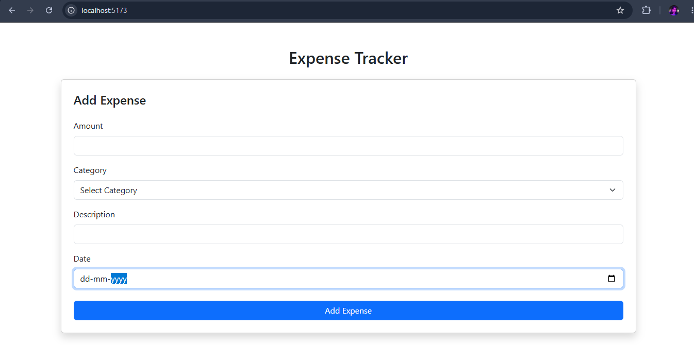
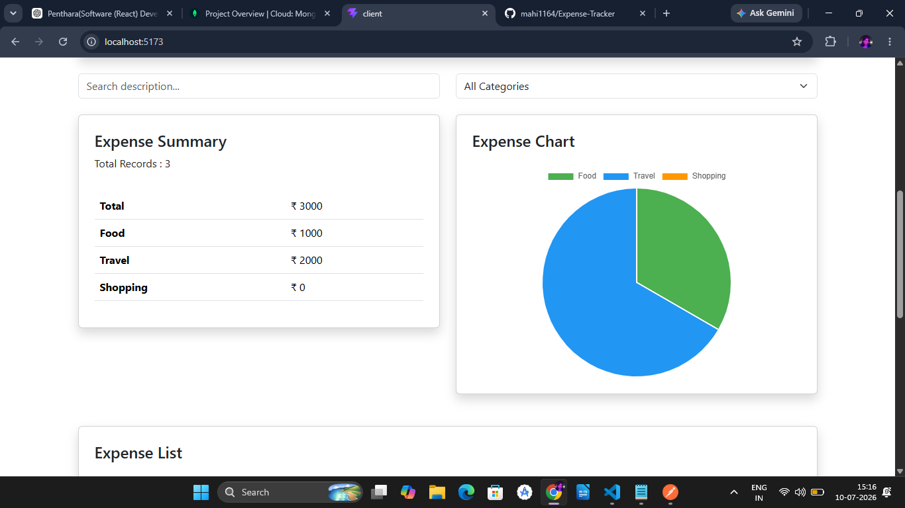

# Expense Tracker

A full-stack Expense Tracker application built using React, Node.js, Express and MongoDB Atlas.

## Dashboard



## Features

- Add new expenses
- View all expenses
- Delete expenses
- Expense summary
- Category-wise expense calculation
- Search expenses
- Filter by category
- Expense chart (Chart.js)

## Tech Stack

### Frontend

- React
- Bootstrap
- Axios
- Chart.js

### Backend

- Node.js
- Express.js
- MongoDB Atlas
- Mongoose

## Folder Structure

```
Expense-Tracker
│
├── client
│   ├── src
│   ├── public
│   └── package.json
│
├── server
│   ├── config
│   ├── controllers
│   ├── models
│   ├── routes
│   ├── server.js
│   └── package.json
```

## Installation

### Clone

```bash
git clone <repository-url>
```

### Backend

```bash
cd server
npm install
node server.js
```

### Frontend

```bash
cd client
npm install
npm run dev
```

Frontend runs on

```
http://localhost:5173
```

Backend runs on

```
http://localhost:5000
```

## Author

Mahi Panjwani